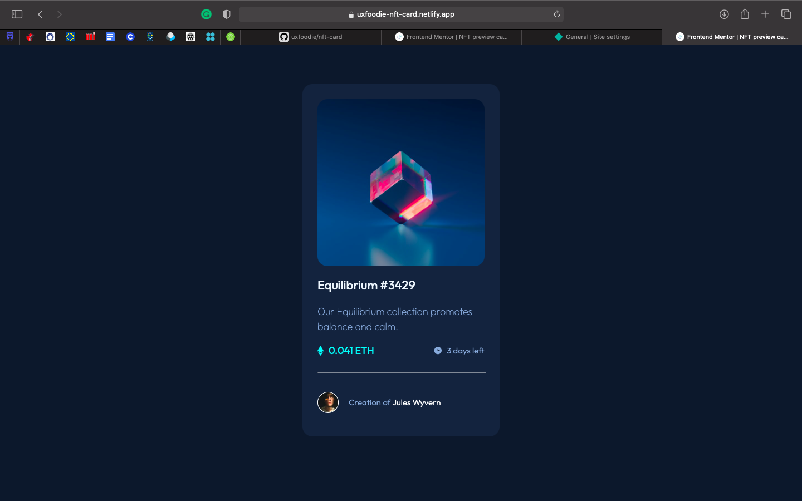
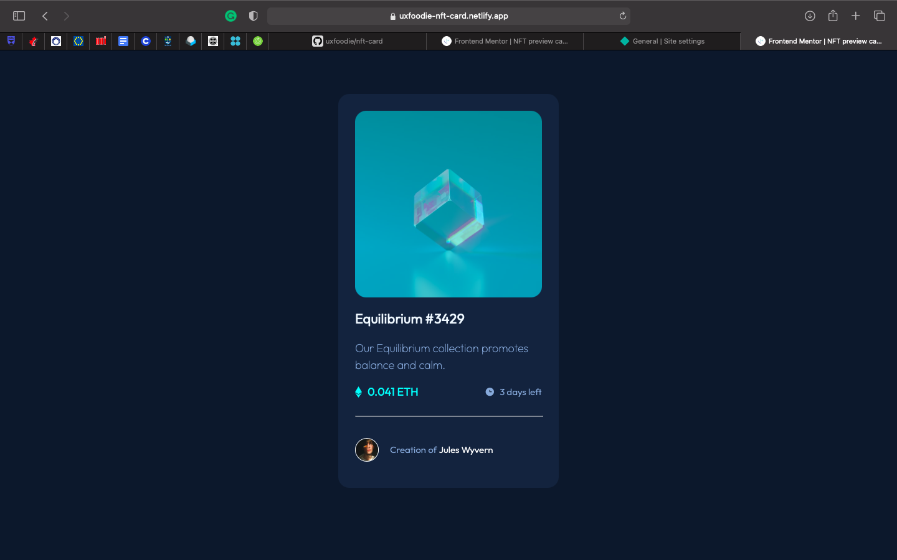
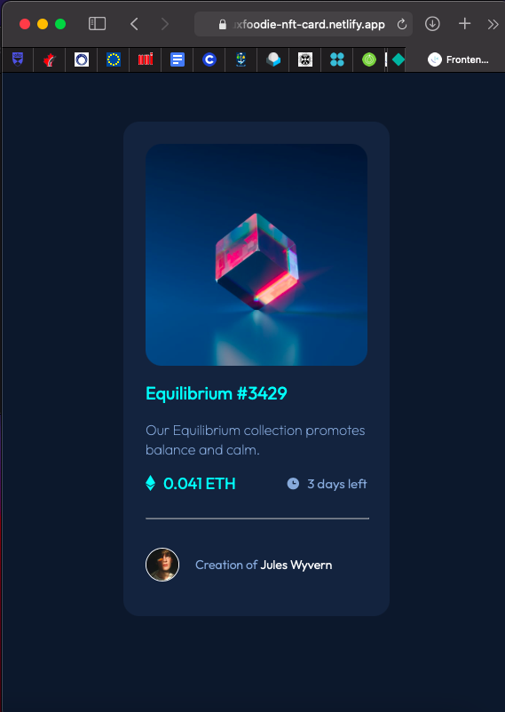

# Frontend Mentor - NFT preview card component solution

This is a solution to the [NFT preview card component challenge on Frontend Mentor](https://www.frontendmentor.io/challenges/nft-preview-card-component-SbdUL_w0U). Frontend Mentor challenges help you improve your coding skills by building realistic projects. 

## Table of contents

- [Overview](#overview)
  - [The challenge](#the-challenge)
  - [Screenshot](#screenshot)
  - [Links](#links)
- [My process](#my-process)
  - [Built with](#built-with)
  - [What I learned](#what-i-learned)
  - [Continued development](#continued-development)
  - [Useful resources](#useful-resources)
- [Author](#author)

## Overview

### The challenge

Users should be able to:

- View the optimal layout depending on their device's screen size
- See hover states for interactive elements

### Screenshot

### Links

- View live site [here](https://uxfoodie-nft-card.netlify.app/)

## My process

### Built with

- Semantic HTML5 markup
- CSS custom properties
- CSS Grid
- Mobile-first workflow

# Mobile view with hover state

### What I learned

I learnt how to apply overlay to images. It took about 30 minutes but I cracked it in the end.

### Continued development

I want to learn flexbox next. I really love my progress.

## Author

- Website - [Blessing Ojediran](https://uxfoodie.myportfolio.com)
- Frontend Mentor - [@uxfoodie](https://www.frontendmentor.io/profile/yourusername)
- Twitter - [@uxfoodie_](https://www.twitter.com/yourusername)
